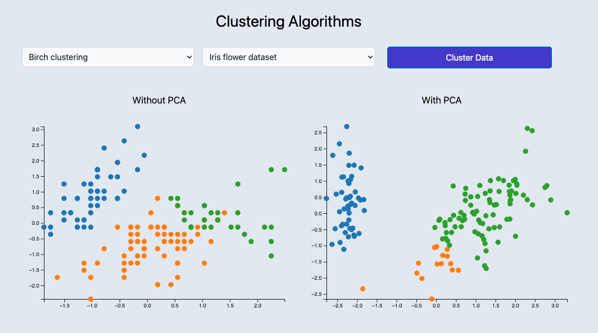

# Clustering Algorithms

A full-stack application for visualizing and comparing different clustering algorithms. Built with FastAPI backend and React frontend, containerized with Docker.

This application provides a set of endpoints for running various clustering algorithms using `scikit-learn`, allowing users to perform clustering tasks on different datasets and visualize the results interactively.



## Features

- **Multiple Clustering Algorithms**: KMeans, DBSCAN, Birch, and Mean Shift
- **Built-in Datasets**: Iris, Wine, Breast Cancer, and Handwritten Digits datasets
- **PCA Support**: Optionally use PCA to reduce dimensionality before clustering
- **Interactive Visualization**: D3.js charts for real-time cluster visualization
- **Responsive Design**: Modern UI built with React and Tailwind CSS

## Architecture

- **API**: FastAPI backend with machine learning clustering algorithms (Python 3.12)
- **Frontend**: React application with Vite for visualization (Node.js 18)

## Quick Start

### Prerequisites
- Docker and Docker Compose installed

### Running the Application

```bash
# Clone the repository
git clone https://github.com/madeleinewoodbury/clustering-algorithms.git
cd clustering-algorithms

# Start both services
docker-compose up

# To rebuild containers after changes
docker-compose up --build

# To stop services
docker-compose down
```

### Accessing the Application

- **Frontend**: http://localhost:3000
- **API**: http://localhost:8000
- **API Documentation**: http://localhost:8000/docs

## Development

The setup includes hot-reload for both services:
- API changes in `./api/` are automatically reloaded
- Frontend changes in `./frontend/` trigger Vite's hot module replacement

## API Documentation

### Available Endpoints

#### 1. Get Available Algorithms
- **GET** `/cluster/algorithms`
- **Description**: Gets the available clustering algorithms
- **Response**:
```json
{
    "algorithms": {
        "birch": "Birch clustering",
        "dbscan": "DBSCAN clustering", 
        "kmeans": "Kmeans clustering",
        "mean_shift": "Mean shift clustering"
    }
}
```

#### 2. Get Available Datasets
- **GET** `/cluster/dataset`
- **Description**: Gets the available datasets
- **Response**:
```json
{
    "datasets": {
        "breast_cancer": "Breast cancer dataset",
        "digits": "Handwritten digits dataset",
        "iris": "Iris flower dataset", 
        "wine": "Wine recognition dataset"
    }
}
```

#### 3. Run Clustering
- **POST** `/cluster`
- **Description**: Run clustering algorithm on the provided dataset
- **Request Body**:
```json
{
  "algorithm": "kmeans",
  "dataset": "breast_cancer", 
  "use_pca": false
}
```
- **Response**:
```json
{
  "labels": [],
  "data": [],
  "feature_names": []
}
```

## Project Structure

```
clustering-algorithms/
├── docker-compose.yml    # Orchestrates both services
├── api/                  # FastAPI backend
│   ├── Dockerfile
│   ├── requirements.txt
│   └── ...
└── frontend/             # React frontend
    ├── Dockerfile
    ├── package.json
    └── ...
```